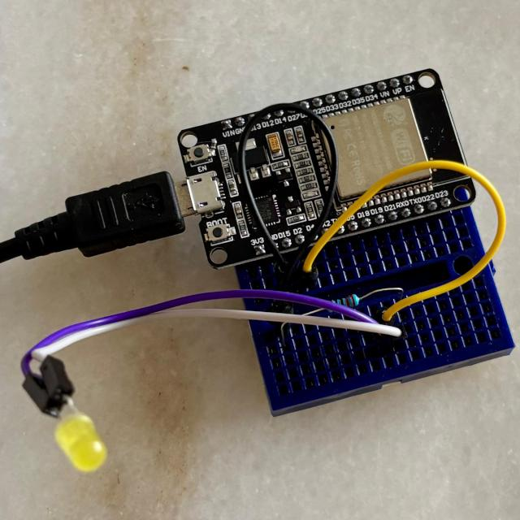

# ESP32 LED Clock

> **Supported Target:** ESP32  
> **Note:** This code was generated using ChatGPT for iOS version 1.2024.347 on an iPhone 8.

This project implements an ESP32-based clock that connects to Wi-Fi, obtains the current time via SNTP, and blinks an LED based on the time of day. It also supports deep sleep to conserve power between operations.

## Functionality

- Blinks the LED once every 15 minutes (at 00, 15, 30, and 45 minutes past the hour).
- At the top of the hour, blinks a number of times corresponding to the current hour (e.g., 12 blinks at noon).
- The noon chime blinks more slowly than the hourly blinks.
- The device enters deep sleep and wakes up every 60 seconds to update time and blink accordingly.

---

## Software Environment

- **IDE:** Visual Studio Code with ESP-IDF extension  
- **Framework:** ESP-IDF v5.3.3  
- **Operating System:** Debian GNU/Linux 12 (Bookworm)
    ```bash
    pi@raspberrypi:~/esp $ cat /etc/os-release
    PRETTY_NAME="Debian GNU/Linux 12 (bookworm)"
    ...

    pi@raspberrypi:~/esp $ cat /proc/version
    Linux version 6.12.25+rpt-rpi-v8 ...
    ```

> **Before compiling and flashing:**  
> Update your Wi-Fi SSID and password in **menuconfig**:  
> VSCode > ESP-IDF Explorer > SDK Configuration Editor

---

## Project Overview

### 1. Features

- Connects to Wi-Fi and synchronizes time via NTP
- Blinks an LED:
  - Once every 15 minutes
  - Hourly based on the current hour
- Uses deep sleep to save battery life
- Resynchronizes time periodically (approximately every 24 wake cycles, ~24 minutes)

### 2. Deep Sleep Behavior

- **First Boot:** Connects to Wi-Fi and syncs time via SNTP.
- **Subsequent Wakeups:** Uses RTC time to avoid frequent resynchronization.
- **Time Zone:** Singapore (UTC+8)
- **Wake Count:** Stored in RTC memory
- **Sleep duration:** Longer duration after quarter chime once, then return to normal duration.

---

## Example Blink Durations

| Event        | Blink Count | Delay per Blink | Total Duration |
|--------------|-------------|------------------|----------------|
| 3 AM Hourly  | 3           | 100 ms           | ~0.6 sec       |
| 12 PM (Noon) | 12          | 200 ms           | ~4.8 sec       |

> *Note:* A pause is inserted after every three blinks for clarity.

---

## Hardware

The board includes an onboard LED connected to a GPIO pin (default: **GPIO2**).

### Optional External LED Wiring

| LED Pin | ESP32 Pin | Note                         |
|---------|-----------|------------------------------|
| Anode   | GPIO2     | Configurable via `menuconfig`|
| Cathode | GND       | Through a 220Ω resistor      |



---
author: Alvin T W Ng @2025
